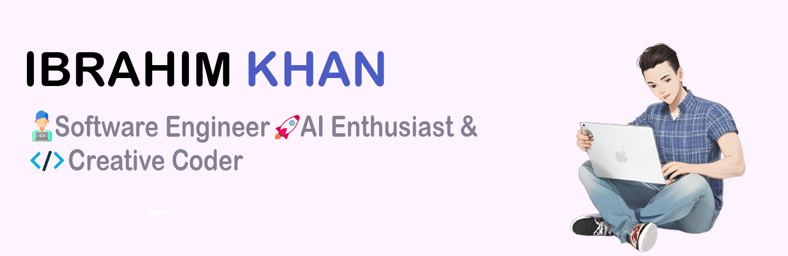

### Hi there 👋!

<dl>
  <dd>
    <dl>
      <dd>
      </dd>
    </dl>
  </dd>
</dl>

#### Who I am?

- A Javascript Developer based in **[Dhaka](https://en.wikipedia.org/wiki/Dhaka), [Bangladesh](https://en.wikipedia.org/wiki/Bangladesh).**
- working as a Software Engineer at **[SaRa LifeStyle Ltd.](https://saralifestyle.com/).**

#### What I'm doing?

- 👨‍💻 Writing `react` `react native` `nodejs` `TypeScript`.
- 🌍 Mostly active on .
- 📚 Currently learning about **Generative AI**,**Prompt Enginnering**
- 👯 Looking to collaborate on **React Native Projects**.
  

#### What I like to disscuss about?

- 💬 Ask me about `Mobile Enginnering` `Cross Platform` `Android` `iOS` and `Tech Culture`.

#### Github Stats

  

  
  

#### What my skill set looks like?

- 🖥 **Front-end & Mobile:**
  - **📜 Languages:** • `👨‍🔧 JavaScript` • `🧚🏻‍♂️ TypeScript` • `🧚🏻‍♂️ Python`
  - **🔬 Frameworks & Libraries:**
    - **🌐 Web:** • [React](https://reactjs.org/) • [Next.js](https://nextjs.org/) • [Material UI](https://mui.com/) • [Tailwind CSS](https://tailwindcss.com/) • [Bootstrap](https://getbootstrap.com/) • [Storybook](https://storybook.js.org/)
    - **📱 Mobile:** • [React Native](https://reactnative.dev/) • [Redux](https://redux.js.org/) • [Zustand](https://github.com/pmndrs/zustand) • [RTK Query](https://redux-toolkit.js.org/) • [Shopify Restyle](https://github.com/Shopify/restyle) • **Native Modules** • **Deep Linking** • **Universal Links** • **Push Notifications** • **SDK Integration**
  - **Testing & Development Tools:** • [Jest](https://jestjs.io/) • [RNTL](https://github.com/callstack/react-native-testing-library) • **React Native Devtools** • **X-Code** • **Android Studio**

- 🗄️ **Back-end & API Integration:**
  - **📜 Languages:** • `🧙🏻‍♂️ JavaScript` • `🧚🏻‍♂️ Python`
  - **🔭 Frameworks:** • [Node.js](https://nodejs.org/en/) • [Express.js](https://expressjs.com/) • **WebSocket** • **JWT**
  - **💾 Databases:** • [MongoDB](https://www.mongodb.com/) • [MySQL](https://www.mysql.com/)
  - **API Integration & Services:** • **REST APIs** • **API Caching** • **JWT Authentication**

- 🎡 **Software Development Ecosystem & Tools:**
  - **Version Control:** • [Git](https://git-scm.com/)
  - **Collaboration & Productivity:** • [Jira](https://www.atlassian.com/software/jira) • [Slack](https://slack.com/)
  - **Performance & Optimization:** • **List Virtualization** • **Memoization** • **Code Splitting** • **Bundle Size Optimization** • **Navigation Optimization** • **Network Optimization** • **Memory Leak Prevention** • **Crashlytics**

#### What's interesting about me?

- 😎 Having thirst about **AI** trends & **Open Source**.
- 🧐 I love to be very **precise** and **thorough**. I hate **procrastinating**.
- ✍️ I write about **why a certain code is written instead of what** in the comments.
- ⏱️ I'm a **workaholic** and drink a lot of ☕ **coffee**.
- 😅 I prefer **outdoor games** to **indoor** games.

###

#### What are my recent highlights?
<!-- - [Shadow Ui](https://twitter.com/WasmWeekly/status/1560266404171231232)
- [Tweetify-simple-crud-tweet-app-using-VanilaJs](https://github.com/IbrahiimKhan/tweet-tweet) -->

#### How to get in touch with me?

 

